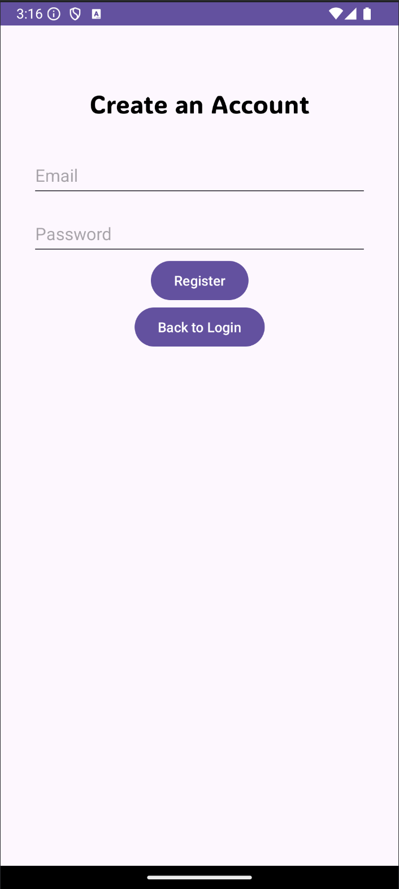
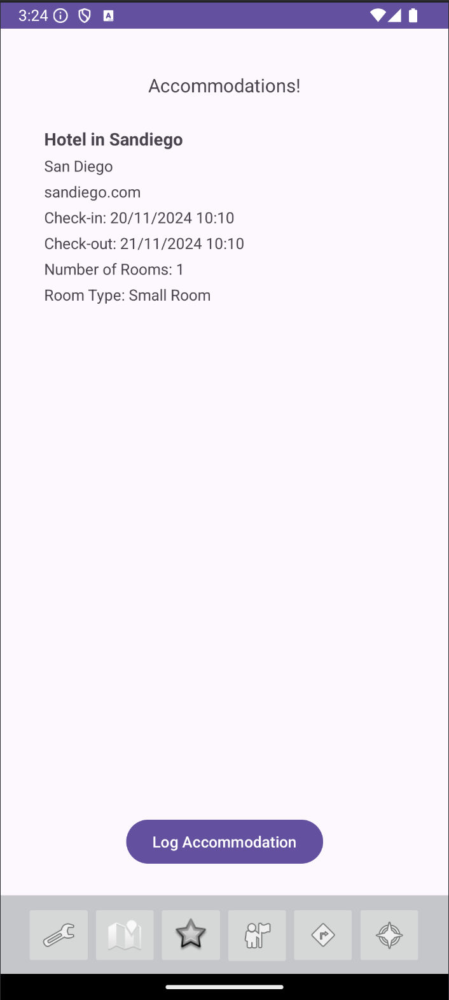

# Introduction
WanderSync is a team project that aimed to ease the process of creating and managing travel itineraries for solo and group travel. This application makes the experience of travel seamless and efficient.
# Design and Architecture
WanderSync follows the follows the model, view and view model (MVVM) architecture to make a clean separation of the methods in the app’s code. 
The application’s user interface (View) is represented by a set of activities and XML layouts, each corresponding to a specific feature screen.
The ViewModel layer manages the interactions with logic, handles user authentication, and ensures data binding between the user interface and underlying data. 
The Model layer, is responsible for managing data interactions, including retrieving and storing data in Firebase (this is more of the backend of the software). With in this archeticture we used several diffrent design patterns to best accomplish our goals. We also made sure to follow SOLID and GRASP principlces, for future scaling and additions. 
# User Interface
Below are some screen shots that demonstarte the the user interface and application flow.

  
  
  
  
  
  
  
  
>

# Functionlaity
Below we have provided a video that goes through the apps easy functionality.
# Conclusion and Reflections
# Contributors
We acknowledge the efforts of all team members who contributed to the app's development:
Catherine Burns
Makenzy Butler
Kunisha Dorasami
Andrew Hlavacek 
Marilyn Pelayo-Montufar

